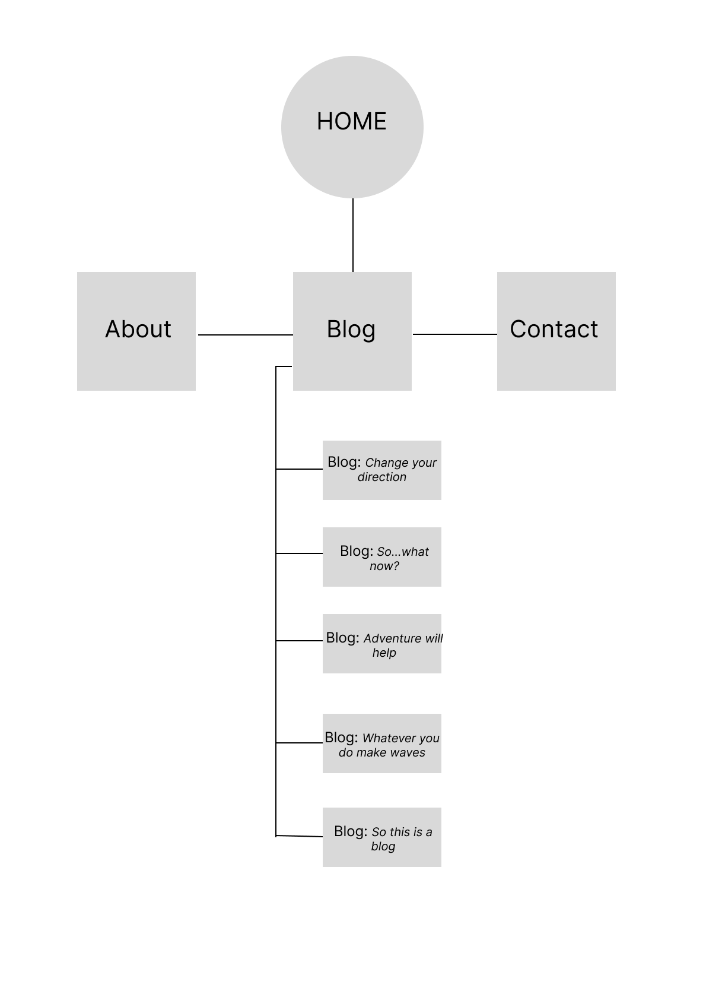

# Duncan Archibald Portfolio Website T1A2
## Links:
#### Portfolio URL:
https://fascinating-cucurucho-157b77.netlify.app/

#### Github repo:
https://github.com/djarchibald/PortfolioT1A2

#### Presentation Video:

## Purpose
Welcome to my portfolio website! It is designed to present me as a web developer to prospective employers or recruiters looking to hire a junior developer. The site provides users with an overview about my career to date, and account of my decision to change careers and transition into tech, as well as a brief overview of my interests outside work.  Using the links on the 'About' page and in the footer, users can access my CV and Linkedin account, both of which give a more in depth look at the transferable skills I have demonstrated in my career to-date and will in the future cover the technical skills I aquire during the bootcamp.  

As someone extremely new to coding - this site is my first start to finish build -  my overall approach to was to keep things relatively simple wherever possible, while still meeting the assignment objectives and criteria outlined in the marking rubric. The site is designed to evolve in line with my technical skills as they improve over time - it is my intent that it will become significantly more sophisticated over the course of the bootcamp, ultimately allowing me to credibly use it as a key part of my job search.

## Features & Functionality

The 'keep it simple' approach informed the majority of decisions I took as I built the site. From the outset I was keen that my website had a clean, uncluttered look and feel, with intuitive navigation and functionality whether viewed on a phone, tablet or desktop sized device. 

Accessibility was also an important consideration, including in my decision to use sans-serif style fonts throughout the website, as well as a reasonably high contrast colour-scheme which sees either dark text on light backgrounds or light text on dark backgrounds, both of which I hope will assist any users with dyslexia or sight issues. The site also features alt-text for all images used. 

Critically, users are able to contact me through every page on the site - either connecting to my social media accounts (Instagram, Twitter, LinkedIn and github), using the contact form to send me a message, or by clicking on the mail or phone links in the footer.  

As you can see in the sitemap below, my website consists of a home/landing page, about, blog and contact pages. From the blog page, users are able to access 5 example (and currently dummy) blog posts.

#### Sitemap

As mentioned above, all pages have a consistent header and footer. Aesthetically, I wanted to use these to reinforce to the user the sense of clean modern branding, allowing users to easily identify what website they're on. And in terms of utility, the header and footer enable users to navigate easily between pages and access the information they're looking for. Perhaps most importantly though, the header and footer allows users to contact me regardless of where they are on the website. As the main purpose of the site is ultimately to assist in getting me a job, I wanted to make it as easy as possible for users to connect with me whether through my social media accounts or the clickable mail and phone links. This means that a time poor user doesnt have to spend time navigating to the contact page if they decide they want to get in touch.

The screenshot below shows a mobile phone view of the header, including clickable logo and links to other pages, and footer, with links to social media, as well as clickable phone and mail links:

A further feature of the site is the contact form on the 'contact' page.  While at the moment there is no back-end behind the form enabling it to work, it will in the future allow users a simple way to send me their contact details and message, if they prefer this method of contact. As you can see in the screenshot below, the form also fits the overall look of the site, matching the color scheme and generally maintaing the simple, uncluttered feel.

In line with the assignment rubric, my site is responsive. The screenshots below show the difference in the landing page at mobile and desktop views. 

## Tech Stack
The site was built using HTML and vanilla CSS, and deployed using netlify via my github repo.

## HTML
Created the basic structure in terminal, moved to VS Code. Then created the header, linked the CSS stylesheet and set out other main containers (main and footer)

Header contains title of website and navigation

## CSS
Established a CSS stylesheet. Defined colorscheme, and added colors to text and backgrounds. 
Flexed the header to align the elements within it. 

Social media icon references:

git

https://commons.wikimedia.org/wiki/File:Octicons-mark-github.svg GitHub, MIT <http://opensource.org/licenses/mit-license.php>, via Wikimedia Commons

https://commons.wikimedia.org/wiki/File:LinkedIn_icon_circle.svg LinkedIn, Public domain, via Wikimedia Commons

https://commons.wikimedia.org/wiki/File:Twitter_Logo.png AlvaroMolina, Public domain, via Wikimedia Commons

https://commons.wikimedia.org/wiki/File:Instagram_logo_2016.svg Instagram, Public domain, via Wikimedia Commons

## web pic reference

https://pixabay.com/photos/spider-web-cobwebs-branch-shrub-3860421/
Image by <a href="https://pixabay.com/users/tantetati-77004/?utm_source=link-attribution&amp;utm_medium=referral&amp;utm_campaign=image&amp;utm_content=3860421">Kati</a> from <a href="https://pixabay.com//?utm_source=link-attribution&amp;utm_medium=referral&amp;utm_campaign=image&amp;utm_content=3860421">Pixabay</a>

Image by <a href="https://pixabay.com/users/fotoblend-87167/?utm_source=link-attribution&amp;utm_medium=referral&amp;utm_campaign=image&amp;utm_content=6269254">Willfried Wende</a> from <a href="https://pixabay.com//?utm_source=link-attribution&amp;utm_medium=referral&amp;utm_campaign=image&amp;utm_content=6269254">Pixabay</a>

https://pixabay.com/photos/cobweb-dew-dandelion-seed-web-6269254/ Free for commercial use
No attribution required

## Blog post image refs

compass
https://www.pexels.com/photo/compass-on-hand-3203659/ Photo by Bakr Magrabi

What now
https://www.pexels.com/photo/person-holding-a-cardboard-banner-with-what-now-written-on-it-5802888/ photo by Jeff Stapleton

Laptop
https://pixabay.com/photos/people-man-dark-night-sunset-2586889/ photo by Stocksnap

forest
https://pixabay.com/photos/nature-forest-frost-snowy-trees-2147400/ image by invisiblepower

ocean
https://pixabay.com/photos/ocean-sea-waves-dawn-dusk-1867285/ image by pexels from pixabay